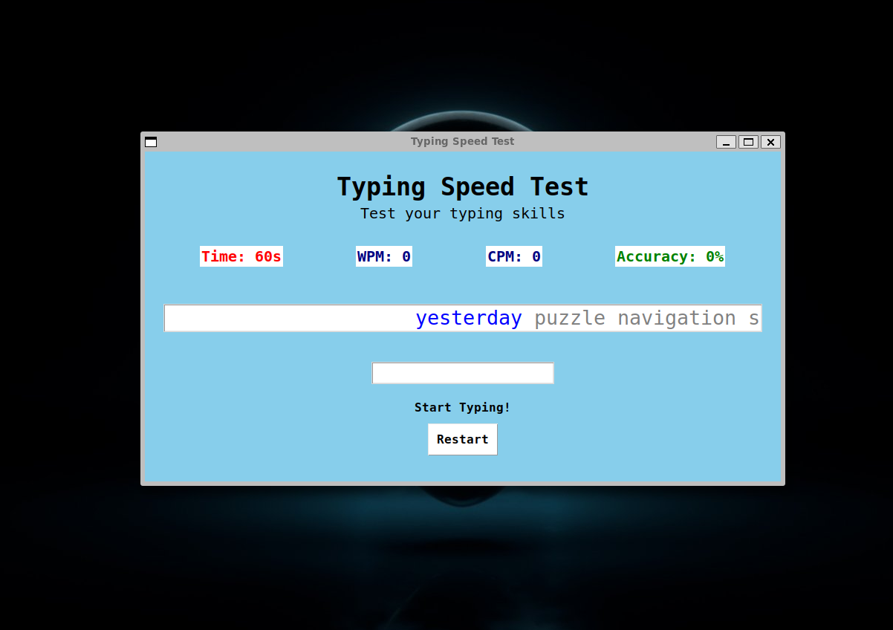
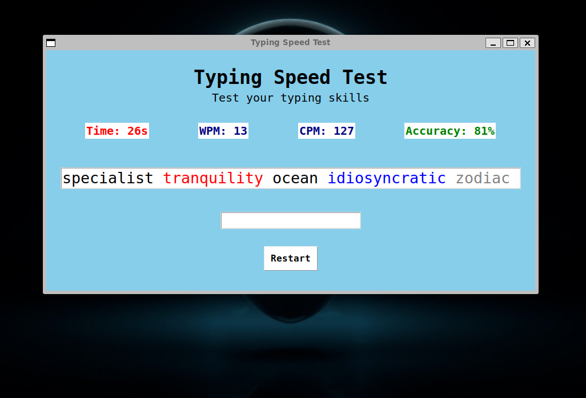
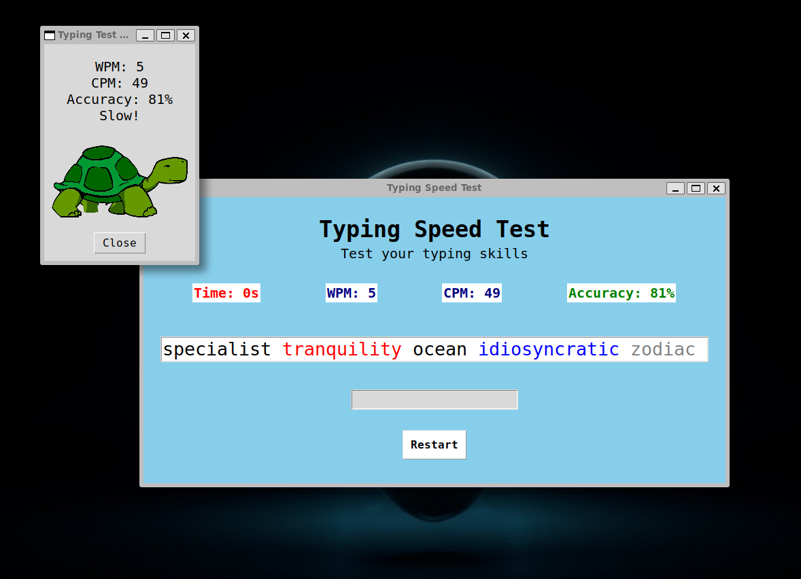

# Typing Speed Test


This is a simple typing speed test application built using Python and Tkinter. The application measures your typing speed in words per minute (WPM) and characters per minute (CPM), and also calculates your typing accuracy.

## Features

- Displays a random sequence of words for the user to type.
- Measures typing speed in WPM and CPM.
- Calculates typing accuracy.
- Provides feedback on typing speed (Fast or Slow).
- Displays an image based on typing speed (cheetah for fast, tortoise for slow).
- Allows restarting the test.

## Requirements

- Python 3.x
- Tkinter library (usually included with Python installations)

## Installation

1. Clone the repository or download the source code.
2. Ensure you have Python 3.x installed on your system.
3. Install Tkinter if it's not already installed.

## Usage

1. Navigate to the directory containing the source code.
2. Run the `main.py` file using Python:
    ```sh
    python main.py
    ```
3. The application window will open. Start typing in the input field to begin the test.

## Files

- `main.py`: The main application script.
- `assets/word_list.txt`: A text file containing a list of words used in the test.
- `assets/tortoise.png`: Image displayed for slow typing speed.
- `assets/cheetah.png`: Image displayed for fast typing speed.

## How It Works

1. The application loads a list of words from `assets/word_list.txt`. If the file is not found, a default list of words is used.
2. The user starts typing in the input field. The timer starts when the user begins typing.
3. The application checks the typed word against the expected word and updates the display accordingly.
4. The application calculates WPM, CPM, and accuracy in real-time and displays the results.
5. When the time is up, the application shows the final results and an image based on the typing speed.

## Screenshots





## License

This project is licensed under the MIT License. See the [LICENSE](LICENSE) file for details.

## Acknowledgements

- Tkinter documentation and tutorials
- Python community for support and resources
